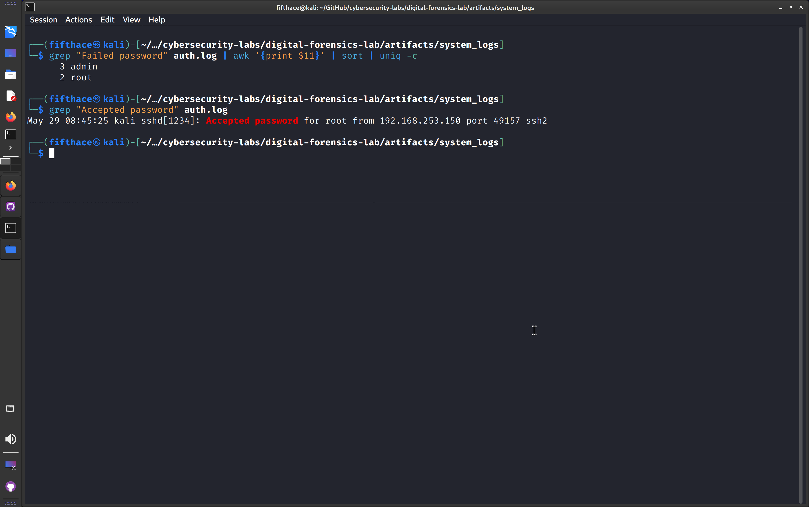

# Forensic Analysis Report: Authentication Subsystem Compromise

## 1. Executive Summary
On May 29, 2026, a targeted forensic triage was initiated on the local authentication artifacts (`auth.log`) of the development system. The objective was to investigate suspicious automated authentication patterns. The analysis confirmed a successful brute-force attack originating from an internal network address, leading to unauthorized root-level access.

## 2. Evidence Preservation & Integrity
* **Source Artifact:** `/artifacts/system_logs/auth.log`
* **Log Format:** Standard Linux Auth Log (ASCII text)
* **Analysis Timestamp:** May 29, 2026, 09:45 AM BST

## 3. Indicators of Compromise (IoC)
The following malicious attributes were extracted during the incident triage phase:
* **Attacker IP Address:** `192.168.253.150`
* **Target Accounts:** `admin` (non-existent), `root` (compromised)
* **Attack Vector:** SSH Password Brute-Force / Dictionary Attack
* **Total Failed Attempts:** 5

## 4. Chronological Timeline of Events
The attack spanned a total duration of 15 seconds before successful penetration:

| Timestamp (May 29) | Event Source | Target User |   Outcome   |               Details / Port               |
| :----------------- | :----------- | :---------- | :---------- | :----------------------------------------- |
| 08:45:10           | `sshd`       | `admin`     | FAILURE     | Invalid user password attempt (Port 49152) |
| 08:45:12           | `sshd`       | `admin`     | FAILURE     | Invalid user password attempt (Port 49153) |
| 08:45:15           | `sshd`       | `admin`     | FAILURE     | Invalid user password attempt (Port 49154) |
| 08:45:18           | `sshd`       | `root`      | FAILURE     | Valid user password attempt (Port 49155)   |
| 08:45:20           | `sshd`       | `root`      | FAILURE     | Valid user password attempt (Port 49156)   |
| **08:45:25**       | `sshd`       | **`root`**  | **SUCCESS** | **Authentication accepted (Port 49157)**   |
| 08:46:02           | `sshd`       | `root`      | SESSION     | Interactive shell opened (UID 0)           |

## 5. Analytical Process Verification
The technical verification of the malicious patterns was executed using native command-line text stream parsers to filter and aggregate the event timeline.

*Figure 1: Automated extraction of malicious IP addresses and successful compromise indicators using grep and awk utilities.*
