# 🛡️ Cowrie Honeypot Lab

## 📌 Overview

This project demonstrates the deployment of an SSH/Telnet honeypot using Cowrie on an Ubuntu Server.
The lab simulates a real-world attack scenario where an attacker machine (Kali Linux) interacts with a monitored target system.

---

## 🧠 Lab Architecture

| Role        | System        | Purpose                              |
| ----------- | ------------- | ------------------------------------ |
| 🎯 Target   | Ubuntu Server | Runs Cowrie honeypot                 |
| 💣 Attacker | Kali Linux    | Performs attacks (SSH / brute-force) |

---

## 🎯 Objectives

* Deploy Cowrie honeypot on Ubuntu Server
* Simulate unauthorized access attempts
* Capture attacker behavior and credentials
* Analyze logs generated by the honeypot
* Document the entire process step-by-step

---

## ⚙️ Environment Setup

### 📋 Prerequisites
* **OS:** Ubuntu Server 25.10 LTS (Target) / Kali Linux (Attacker)
* **Software:** Python 3.x, git, build-essential, libssl-dev
* **Network:** Both VMs in the same NAT/Host-only network

### 🖥️ Target Machine (Ubuntu)

Cowrie honeypot is installed and configured on Ubuntu Server.

📸 **SCREENSHOT**


* System ready before installation

---

### 🧪 Attacker Machine (Kali)

Used to simulate attacks against the honeypot.

---

## 🚀 Phase 1 Set up (Ubuntu)

### 🔹 Step 1 — Clone Repository

```bash
git clone https://github.com/cowrie/cowrie
cd cowrie
```

📸 **SCREENSHOT**


### 🔹 Step 2 — Create Virtual Environment

```bash
python3 -m venv cowrie-env
source cowrie-env/bin/activate
```

📸 **SCREENSHOT**


* Active `(cowrie-env)` environment

---

### 🔹 Step 3 — Install Dependencies

```bash
python3 -m pip install --upgrade pip
python3 -m pip install -r requirements.txt
```

📸 **SCREENSHOT**


* Dependencies installed successfully

---

### 🔹 Step 4 — Configuration

```bash
cp etc/cowrie.cfg.dist etc/cowrie.cfg
```

📸 **SCREENSHOT**


* Configuration file created

---

### 🔹 Step 5 — Start Honeypot

```bash
bin/cowrie start -n
```

📸 **SCREENSHOT (KEY)**


* Cowrie running successfully

---

## 💣 Attack Simulation (Kali)

### 🔹 SSH Login Attempt

```bash
ssh root@<UBUNTU_IP> -p 2222
```

📸 **SCREENSHOT**


* Unauthorized login attempt

---

## 📊 Log Analysis (Ubuntu)

```bash
tail -f /opt/cowrie/var/log/cowrie/cowrie.log
```

📸 **SCREENSHOT (GOLD)**


* Captured attacker activity

---

## 🧾 Key Findings

* Attacker IP address recorded
* Session established and fully monitored
* Commands executed captured
* Session duration logged

---

## 🧠 Lessons Learned

* Honeypots provide valuable insight into attacker behavior
* Even simple setups can capture meaningful data
* Proper documentation is critical in cybersecurity projects

---

## 📁 Project Structure

```
honeypot-cowrie/
├── screenshots/
│   ├── phase1-setup/
│   ├── phase2-hydra/
│   └── phase3-elk/
└── README.md
```

---

## 📌 Notes

This lab was conducted in a controlled virtual environment using VMware.
All attacks were simulated for educational purposes only.

---

## 🚀 Phase 2 Hydra

* Perform brute-force attack using Hydra

---

## 💣 Hydra Attack Simulation

### 🔹 Step 6 — Brute-Force Attack from Kali

```bash
hydra -l root -P /usr/share/wordlists/rockyou.txt -s 2222 ssh://192.168.253.152 -t 4 -V
```

📸 **SCREENSHOT (GOLD)**


* Hydra found 3 valid passwords in 2 seconds

---

### 🔹 Step 7 — Verify Captured Credentials (Ubuntu)

```bash
grep "login attempt" /opt/cowrie/var/log/cowrie/cowrie.log | tail -20
```

📸 **SCREENSHOT (GOLD)**


* Cowrie captured all 4 login attempts from attacker IP 192.168.253.141
* 3 successful logins recorded: `12345`, `password`, `123456789`

---

## 🧾 Key Findings

* Attacker IP recorded: `192.168.253.141`
* 4 login attempts captured by Cowrie
* 3 valid passwords found: `12345`, `password`, `123456789`
* All credentials logged with timestamp

---

## 🧠 Lessons Learned

* Honeypots provide valuable insight into attacker behavior
* Even simple setups can capture meaningful data
* Hydra can crack weak passwords in seconds
* Cowrie logs every attempt with full credentials and timestamps
* Proper documentation is critical in cybersecurity projects

---

### 🚀 Phase 3 — Log Analysis with ELK Stack

* Analyze Cowrie honeypot logs using Elasticsearch and Kibana
* Visualize attacker behavior, captured credentials and session data

---

## 📊 Log Analysis — ELK Stack (Elasticsearch + Kibana)

### 🔹 Step 8 — Install Elasticsearch (Ubuntu)

Add GPG key and repository:

```bash
wget -qO - https://artifacts.elastic.co/GPG-KEY-elasticsearch | sudo gpg --dearmor -o /usr/share/keyrings/elasticsearch-keyring.gpg
echo "deb [signed-by=/usr/share/keyrings/elasticsearch-keyring.gpg] https://artifacts.elastic.co/packages/8.x/apt stable main" | sudo tee /etc/apt/sources.list.d/elastic-8.x.list
```

Install Elasticsearch:

```bash
sudo apt update && sudo apt install elasticsearch -y
```

📸 **SCREENSHOT**

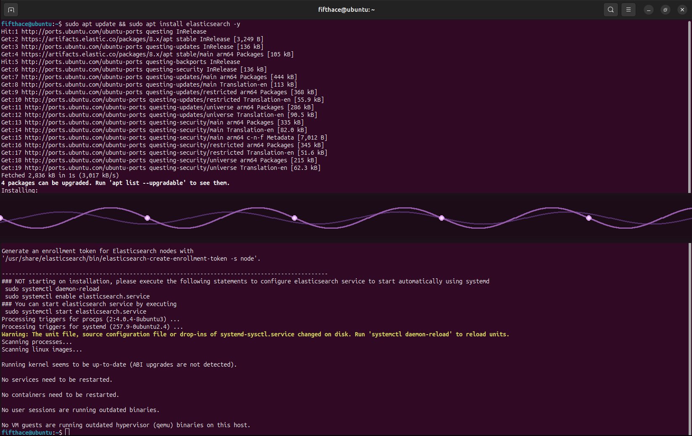

* Elasticsearch 8.19.15 installed and running on ARM64

Enable and start service:

```bash
sudo systemctl daemon-reload
sudo systemctl enable elasticsearch.service
sudo systemctl start elasticsearch.service
sudo systemctl status elasticsearch.service
```

📸 **SCREENSHOT**

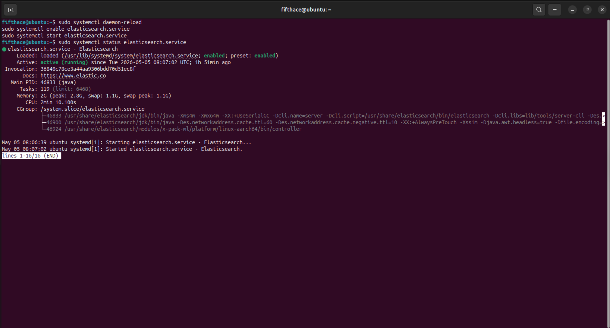

* Elasticsearch status active (running)

---

### 🔹 Step 9 — Install Kibana (Ubuntu)

```bash
sudo apt install kibana -y
```

📸 **SCREENSHOT**

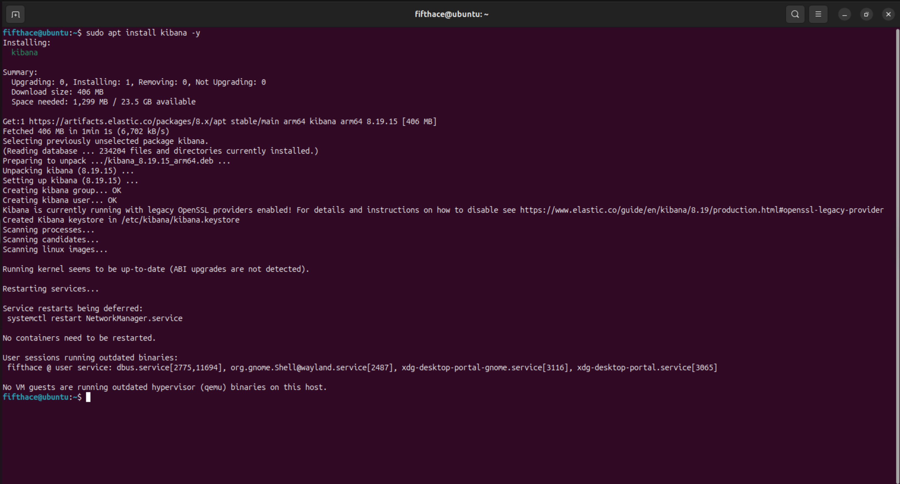

* Kibana installed successfully

Enable and start service:

```bash
sudo systemctl enable kibana.service
sudo systemctl start kibana.service
sudo systemctl status kibana.service
```

📸 **SCREENSHOT**

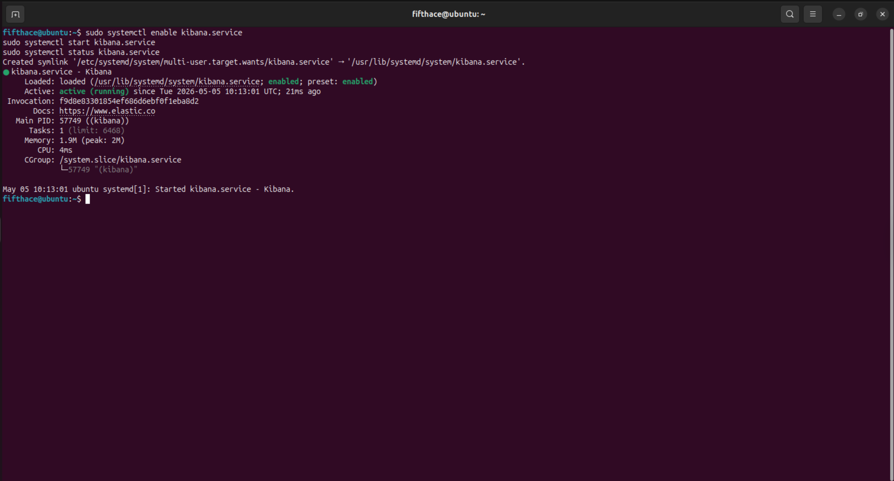

* Kibana status active (running)

---

### 🔹 Step 10 — Install and Configure Filebeat (Ubuntu)

```bash
sudo apt install filebeat -y
```

📸 **SCREENSHOT**

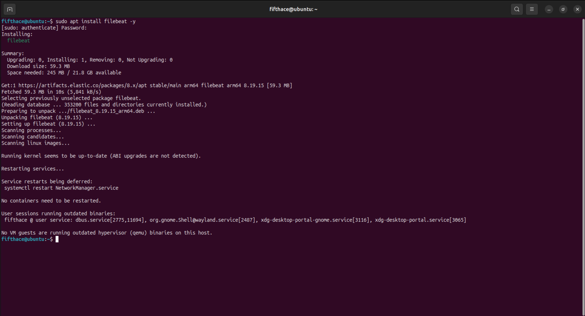

Edit `/etc/filebeat/filebeat.yml`:
* Set input path to `/opt/cowrie/var/log/cowrie/cowrie.json`
* Enable JSON parser

Enable and start service:

```bash
sudo systemctl enable filebeat
sudo systemctl start filebeat
sudo systemctl status filebeat
```

📸 **SCREENSHOT**

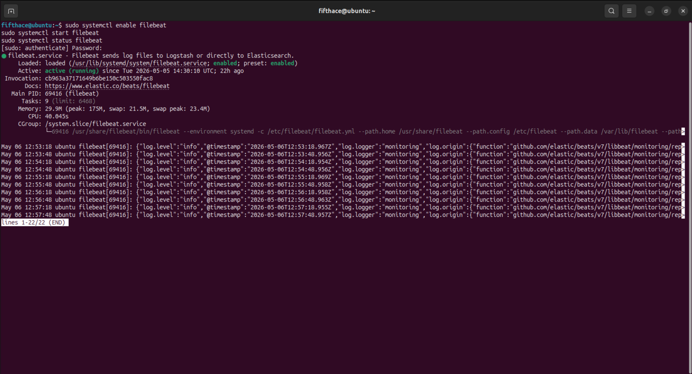

* Filebeat status active (running) — forwarding Cowrie logs to Elasticsearch

Verify logs indexed in Elasticsearch:

```bash
curl -k -u elastic:xkbKf7op=kzYbBev_4-L https://localhost:9200/_cat/indices?v
```

📸 **SCREENSHOT**

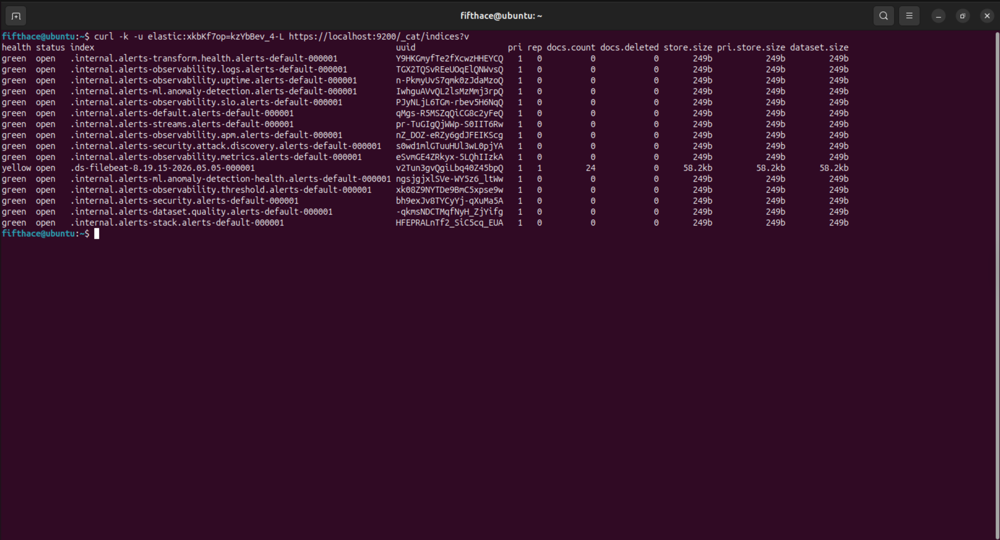

* 24 log events successfully indexed in Elasticsearch (including login attempts, command execution, and session activity)

---

### 🔹 Step 11 — Visualize in Kibana Dashboard

Access Kibana at `http://localhost:5601`

📸 **SCREENSHOT**

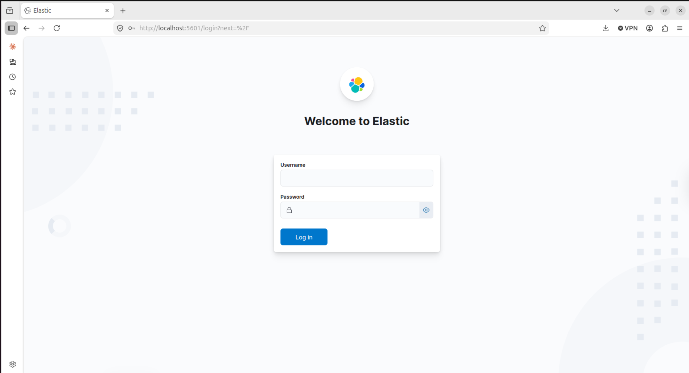

* Kibana login page

Configure enrollment token and connect to Elasticsearch:

📸 **SCREENSHOT**

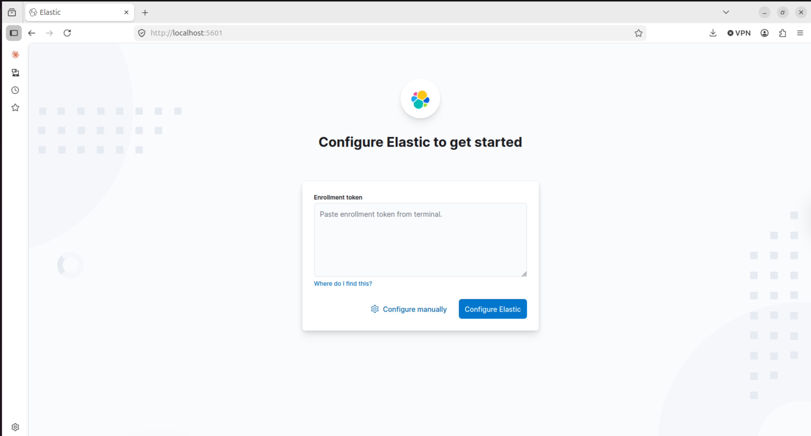

* Kibana successfully connected to Elasticsearch

📸 **SCREENSHOT**

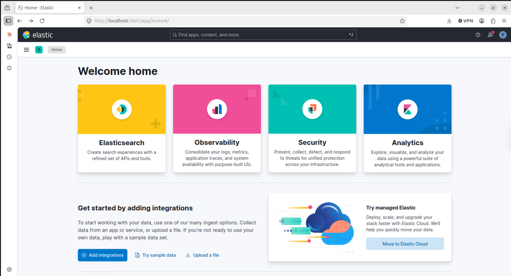

* Kibana home page — ELK Stack ready for log analysis

Create data view `Cowrie Honeypot Logs` with index pattern `filebeat-*`:

📸 **SCREENSHOT**

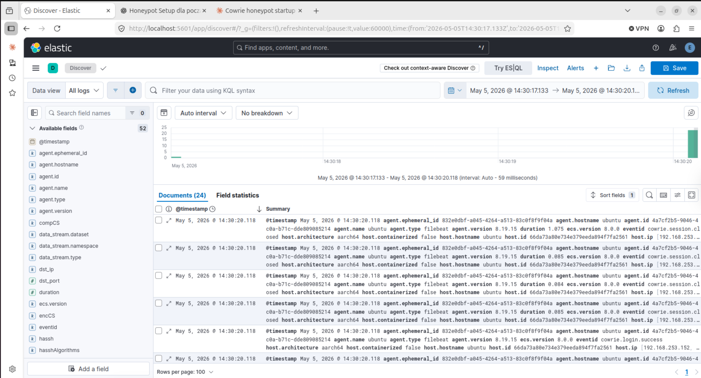

* 24 Cowrie log events visible in Kibana Discover
* Fields captured: `eventid`, `dst_ip`, `duration`, `hassh`, `cowrie.login.success`

Create dashboard with Bar chart visualization — `eventid` vs `Count of records`:

📸 **SCREENSHOT (GOLD)**

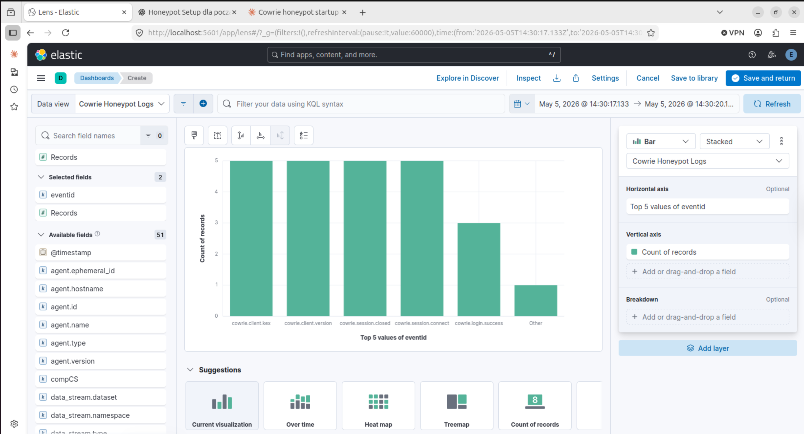

* Cowrie Honeypot Dashboard — attack activity fully visualized
* Events captured: `cowrie.login.success`, `cowrie.session.connect`, `cowrie.session.closed`

---

## 🧾 Key Findings — Phase 3 (ELK Integration)

* Successful integration of Cowrie honeypot with the ELK Stack enabled real-time log collection and analysis
* Filebeat correctly parsed structured JSON logs and forwarded them to Elasticsearch without data loss
* Multiple event types were captured from a single attacker session, including:
* cowrie.session.connect
* cowrie.login.success
* cowrie.command.input
* cowrie.session.closed
* Elasticsearch indexed all events efficiently, allowing fast querying and filtering
* Kibana provided clear visibility into attacker behavior through searchable logs and visual dashboards

Attack simulation from Kali Linux confirmed full end-to-end data flow:
Attacker → Cowrie → Filebeat → Elasticsearch → Kibana

---

## 🔍 Security Insights

* Even a simple SSH interaction generates rich telemetry useful for threat analysis
* Captured credentials (e.g. root:1234) demonstrate how attackers attempt weak/default logins
* Session tracking allows reconstruction of attacker actions step-by-step
* Event-based logging (instead of raw logs) enables precise filtering and detection use cases

---

## 📊 Operational Observations

* Filebeat uses data streams (.ds-filebeat-*) instead of classic indices — modern Elastic approach
* Single session can generate multiple log events, improving visibility but increasing data volume
* Default Kibana dashboards can be extended to build custom threat hunting views

---

## 🧠 Lessons Learned

* Proper log pipeline configuration is critical — small misconfigurations break visibility completely
* Understanding log structure (eventid, JSON parsing) is key for effective analysis
* ELK Stack provides powerful capabilities even in a small lab environment
* Honeypots are not just traps — they are valuable intelligence sources

---

## 🚀 Phase 3 Summary

* The ELK integration phase successfully transformed raw Cowrie logs into structured, searchable, and visualized security data.
* The environment now supports basic threat monitoring, attacker behavior analysis, and log-driven investigation workflows.


