# 🛡️ Cowrie Honeypot Lab

## 📌 Overview

This project demonstrates the deployment of an SSH/Telnet honeypot using Cowrie on an Ubuntu Server.
The lab simulates a real-world attack scenario where an attacker machine (Kali Linux) interacts with a monitored target system.

---

## 🧠 Lab Architecture

| Role        | System        | Purpose                              |
| ----------- | ------------- | ------------------------------------ |
| 🎯 Target   | Ubuntu Server | Runs Cowrie honeypot                 |
| 💣 Attacker | Kali Linux    | Performs attacks (SSH / brute-force) |

---

## 🎯 Objectives

* Deploy Cowrie honeypot on Ubuntu Server
* Simulate unauthorized access attempts
* Capture attacker behavior and credentials
* Analyze logs generated by the honeypot
* Document the entire process step-by-step

---

## ⚙️ Environment Setup

### 📋 Prerequisites
* **OS:** Ubuntu Server 25.10 LTS (Target) / Kali Linux (Attacker)
* **Software:** Python 3.x, git, build-essential, libssl-dev
* **Network:** Both VMs in the same NAT/Host-only network

### 🖥️ Target Machine (Ubuntu)

Cowrie honeypot is installed and configured on Ubuntu Server.

📸 **SCREENSHOT**

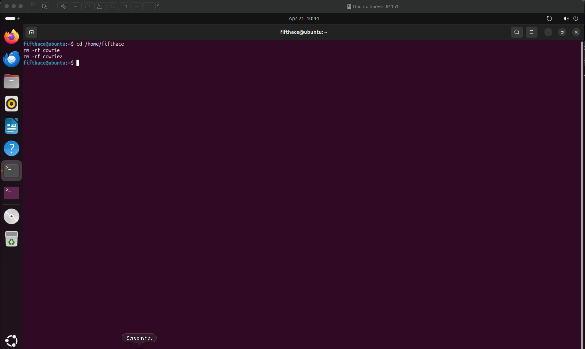

* System ready before installation

---

### 🧪 Attacker Machine (Kali)

Used to simulate attacks against the honeypot.

---

## 🚀 Installation Steps (Ubuntu)

### 🔹 Step 1 — Clone Repository

```bash
git clone https://github.com/cowrie/cowrie
cd cowrie
```

📸 **SCREENSHOT**

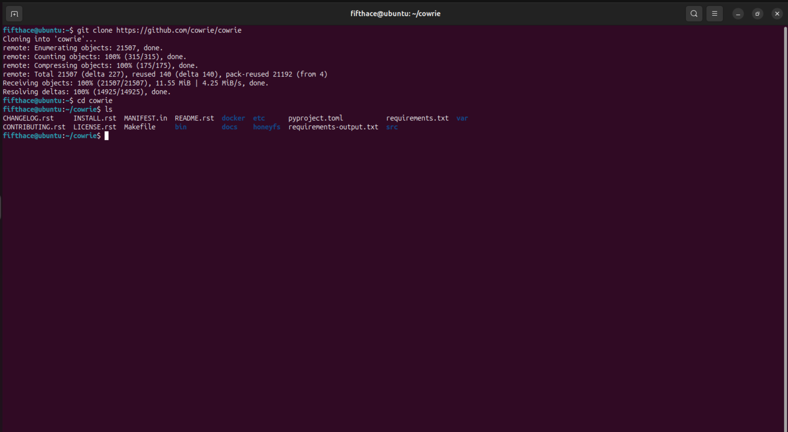


### 🔹 Step 2 — Create Virtual Environment

```bash
python3 -m venv cowrie-env
source cowrie-env/bin/activate
```

📸 **SCREENSHOT**

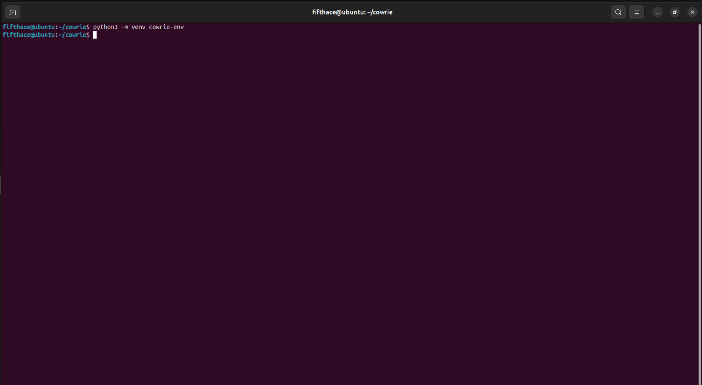
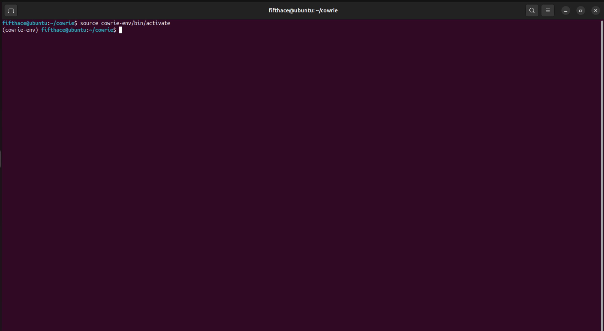

* Active `(cowrie-env)` environment

---

### 🔹 Step 3 — Install Dependencies

```bash
python3 -m pip install --upgrade pip
python3 -m pip install -r requirements.txt
```

📸 **SCREENSHOT**

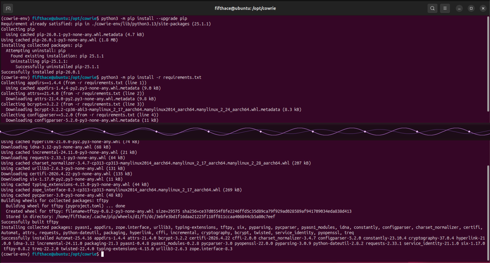

* Dependencies installed successfully

---

### 🔹 Step 4 — Configuration

```bash
cp etc/cowrie.cfg.dist etc/cowrie.cfg
```

📸 **SCREENSHOT**

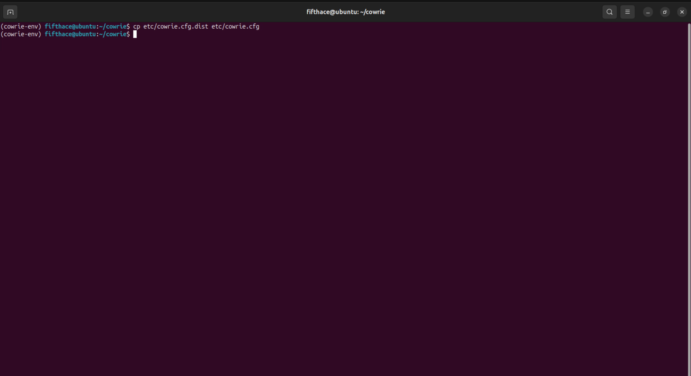

* Configuration file created

---

### 🔹 Step 5 — Start Honeypot

```bash
bin/cowrie start -n
```

📸 **SCREENSHOT (KEY)**

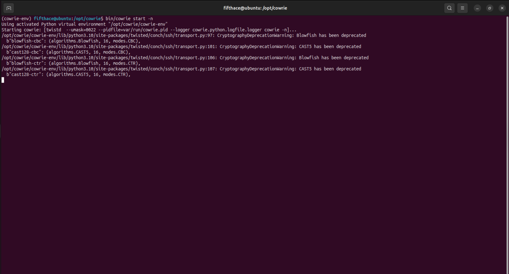

* Cowrie running successfully

---

## 💣 Attack Simulation (Kali)

### 🔹 SSH Login Attempt

```bash
ssh root@<UBUNTU_IP> -p 2222
```

📸 **SCREENSHOT**

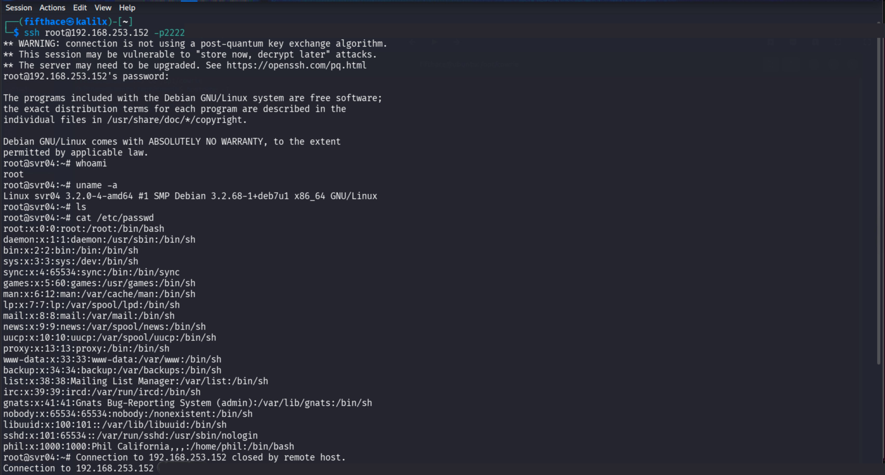

* Unauthorized login attempt

---

## 📊 Log Analysis (Ubuntu)

```bash
tail -f /opt/cowrie/var/log/cowrie/cowrie.log
```

📸 **SCREENSHOT (GOLD)**

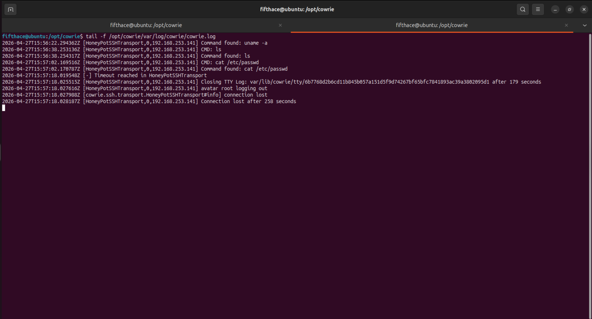

* Captured attacker activity

---

## 🧾 Key Findings

* Attacker IP address recorded
* Session established and fully monitored
* Commands executed captured
* Session duration logged

---

## 🧠 Lessons Learned

* Honeypots provide valuable insight into attacker behavior
* Even simple setups can capture meaningful data
* Proper documentation is critical in cybersecurity projects

---

## 📁 Project Structure

```
honeypot-cowrie/
├── screenshots/
│   ├── phase1-setup/
│   └── phase2-hydra/
└── README.md
```

---

## 📌 Notes

This lab was conducted in a controlled virtual environment using VMware.
All attacks were simulated for educational purposes only.

---

## 🚀 Next Steps

* Perform brute-force attack using Hydra
* Analyze advanced logs
* Integrate with SIEM tools

---

## 💣 Hydra Attack Simulation

### 🔹 Step 6 — Brute-Force Attack from Kali

```bash
hydra -l root -P /usr/share/wordlists/rockyou.txt -s 2222 ssh://192.168.253.152 -t 4 -V
```

📸 **SCREENSHOT (GOLD)**

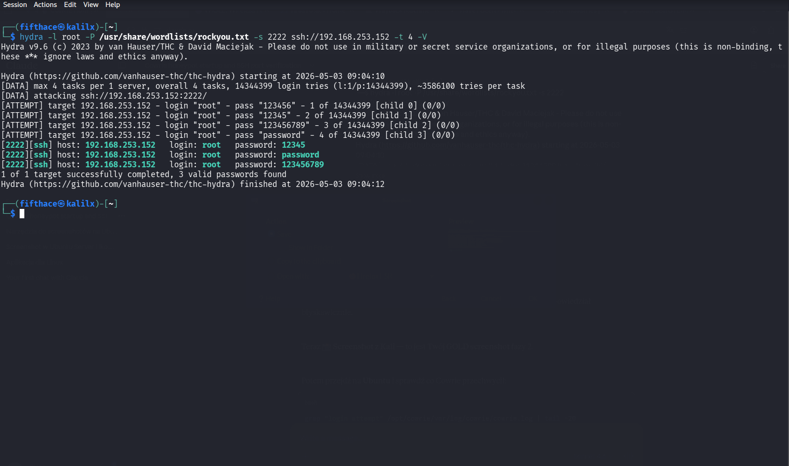

* Hydra found 3 valid passwords in 2 seconds

---

### 🔹 Step 7 — Verify Captured Credentials (Ubuntu)

```bash
grep "login attempt" /opt/cowrie/var/log/cowrie/cowrie.log | tail -20
```

📸 **SCREENSHOT (GOLD)**

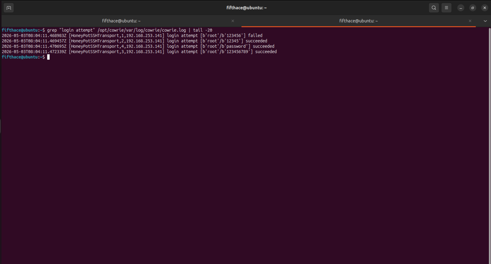

* Cowrie captured all 4 login attempts from attacker IP 192.168.253.141
* 3 successful logins recorded: `12345`, `password`, `123456789`

---

## 🧾 Key Findings

* Attacker IP recorded: `192.168.253.141`
* 4 login attempts captured by Cowrie
* 3 valid passwords found: `12345`, `password`, `123456789`
* Attack duration: 2 seconds
* All credentials logged with timestamp

---

## 🧠 Lessons Learned

* Honeypots provide valuable insight into attacker behavior
* Even simple setups can capture meaningful data
* Hydra can crack weak passwords in seconds
* Cowrie logs every attempt with full credentials and timestamps
* Proper documentation is critical in cybersecurity projects

---


