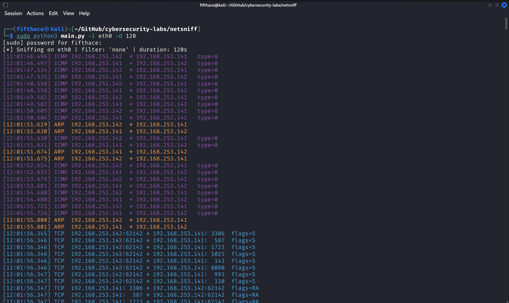
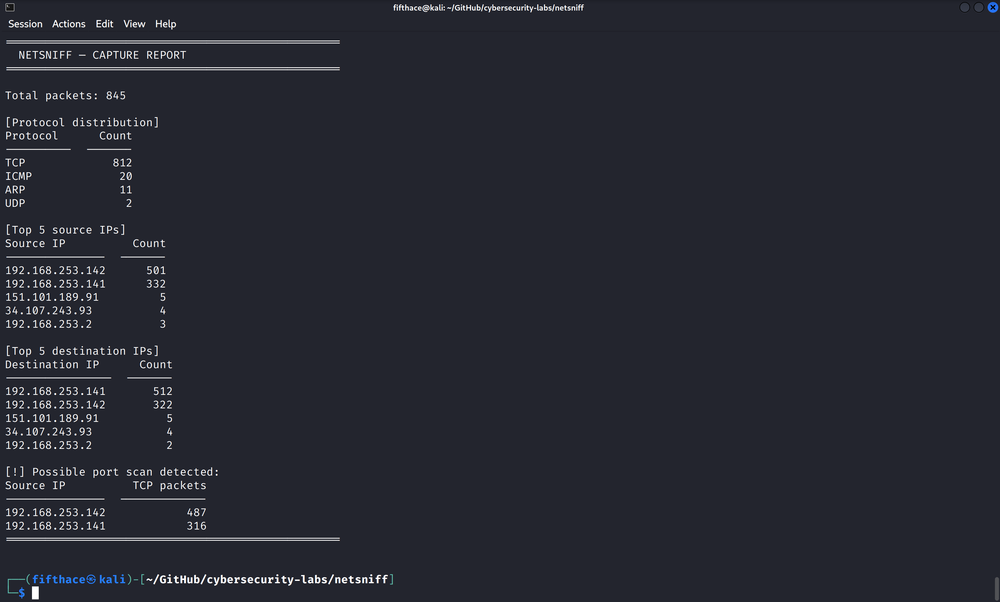

# NetSniff — Network Traffic Analyzer

> A Python-based network packet sniffer built for cybersecurity labs. Captures, parses,
> and analyzes TCP/UDP/ICMP/ARP traffic in real time. Designed for VMware Fusion
> multi-VM environments running Kali Linux, Ubuntu Desktop, Windows 11 Pro,
> and Fedora Linux.


---

## Features

- **Real-time packet capture** — TCP, UDP, ICMP, ARP with color-coded terminal output
- **BPF filters + presets** — built-in shortcuts for HTTP, HTTPS, DNS, SSH, FTP, ICMP
- **Dual export** — saves both `.pcap` (Wireshark-compatible) and `.json` formats
- **Automatic reporting** — protocol distribution, top IPs, port scan detection
- **CLI interface** — fully scriptable via `argparse` flags
- **Lab-ready** — tested across a 4-VM VMware Fusion environment

---

## Lab Environment

| VM | OS | Role |
|---|---|---|
| Attacker/Sniffer | Kali Linux     | Runs NetSniff, captures traffic      |
| Target 1         | Ubuntu Desktop | Hosts Apache, generates HTTP traffic |
| Target 2         | Windows 11 Pro | Generates HTTP/ICMP/SMB traffic      |
| Observer         | Fedora Linux   | Passive traffic generator            |

All VMs share a VMware host-only network (`192.168.253.0/24`).

---

## Installation

**Requirements:** Kali Linux (or any Debian-based Linux), Python 3.10+, root/sudo

```bash
git clone https://github.com/PiotrKleszcz/cybersecurity-labs.git
cd cybersecurity-labs/netsniff
pip3 install -r requirements.txt --break-system-packages
```

> Scapy requires root privileges to open raw sockets. Always run with `sudo`.

---

## Usage

```bash
sudo python3 main.py [OPTIONS]
```

|        Flag         |         Description         |     Default    |
|---------------------|-----------------------------|----------------|
| `-i`, `--interface` | Network interface           | `eth0`         |
| `-f`, `--filter`    | BPF filter or preset name   | none           |
| `-d`, `--duration`  | Capture duration in seconds | `30`           |
| `-c`, `--count`     | Max packets (0 = unlimited) | `0`            |
| `-o`, `--output`    | Output JSON filename        | auto-generated |
| `--no-report`       | Skip summary report         | off            |

### Examples

```bash
# Capture all traffic on eth0 for 30 seconds
sudo python3 main.py -i eth0

# Capture only HTTP traffic for 60 seconds, save to file
sudo python3 main.py -i eth0 -f http -d 60 -o http_capture.json

# Capture HTTPS with custom BPF filter
sudo python3 main.py -i eth0 --filter "tcp port 443" -d 30

# ICMP only (ping monitoring)
sudo python3 main.py -i eth0 -f icmp -d 120

# Capture 500 packets and skip report
sudo python3 main.py -i eth0 -c 500 --no-report
```

### Filter presets

| Preset  | BPF equivalent |
|---------|----------------|
| `http`  | `tcp port 80`  |
| `https` | `tcp port 443` |
| `dns`   | `udp port 53`  |
| `ftp`   | `tcp port 21`  |
| `ssh`   | `tcp port 22`  |
| `icmp`  | `icmp`         |
| `arp`   | `arp`          |

---

## Output

### Terminal (color-coded)

```
[10:42:15.003] TCP  192.168.253.141:52341 → 192.168.253.142:80   flags=S
[10:42:15.021] TCP  192.168.253.142:80    → 192.168.253.141:52341 flags=SA
[10:42:15.022] UDP  192.168.253.141:55312 → 192.168.253.2:53
[10:42:15.088] ICMP 192.168.253.142       → 192.168.253.141        type=8
[10:42:15.102] ARP  192.168.253.1         → 192.168.253.141
```

### Files saved

```
captures/capture_20260514_183732.pcap   <- open in Wireshark
logs/capture_20260514_183733.json       <- parse with Python or jq
```

---

## Screenshots

### Real-time capture


### Capture report


---

## Project Structure

```
netsniff/
├── main.py                  # CLI entry point
├── requirements.txt         # Python dependencies
├── README.md
├── src/
│   ├── __init__.py
│   ├── packet_capture.py    # Scapy sniff engine
│   ├── packet_parser.py     # Protocol decoding
│   ├── filters.py           # BPF presets
│   ├── logger.py            # PCAP + JSON export
│   └── reporter.py          # Stats + port scan alert
├── docs/
│   ├── USAGE.md
│   ├── ARCHITECTURE.md
│   └── screenshots/
├── tests/
│   └── test_parser.py
├── logs/                    # gitignored
└── captures/                # gitignored
```

---

## Security & Ethical Use

> **For educational and authorized testing only.**
> Packet sniffing on networks you do not own or have explicit permission to test is
> illegal in most jurisdictions. This tool is designed for closed VMware lab environments.
> The authors accept no responsibility for misuse.

---

## License

MIT License — see [LICENSE](LICENSE) for details.
