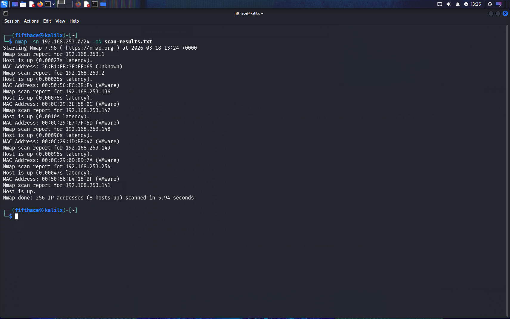
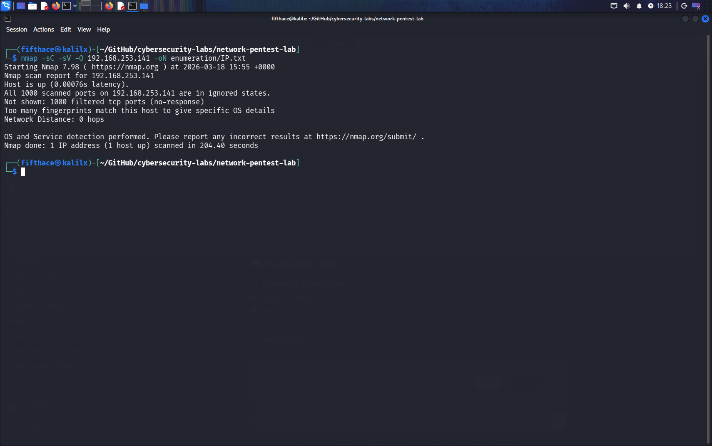
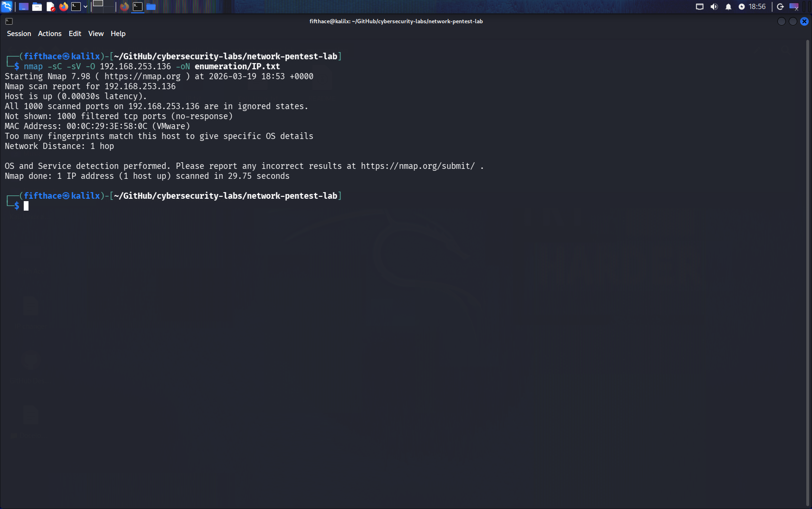
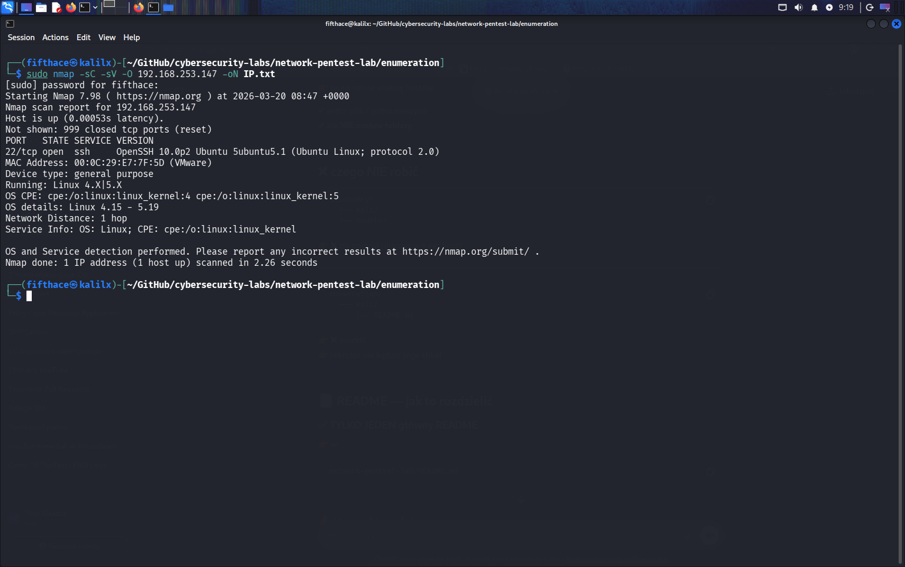
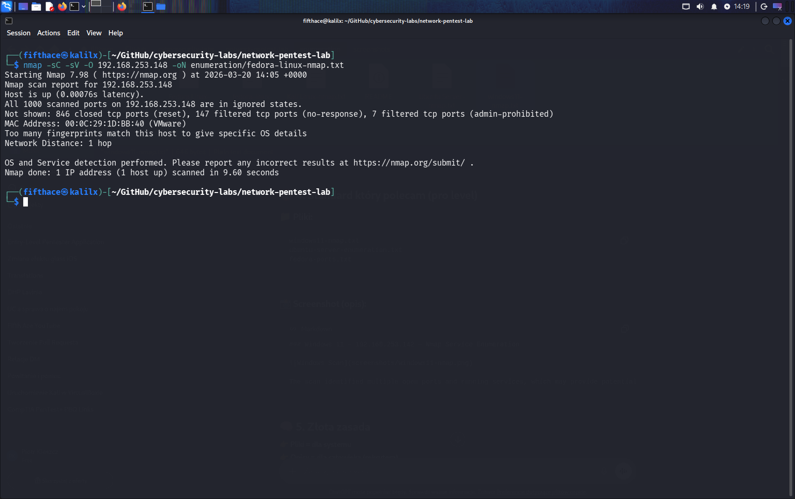

# Network Pentest Lab
## Tools Used
- Kali Linux
- Nmap
- VMware

# 🛡️ Network Pentest Lab

## 📌 Overview

This project documents a controlled network penetration testing lab created using virtual machines.
The goal is to simulate real-world reconnaissance and enumeration techniques using industry-standard tools such as Nmap.

---

## 🖥️ Lab Environment

| Machine       | IP Address      | Role     |
| ------------- | --------------- | -------- |
| Kali Linux    | 192.168.253.141 | Attacker |
| Windows 11    | 192.168.253.136 | Target   |
| Ubuntu Server | 192.168.253.147 | Target   |
| Fedora Linux  | 192.168.253.148 | Target   |
| Fedora Server | 192.168.253.149 | Target   |

---

## 🔍 1. Network Discovery

Initial scan performed to identify active hosts in the network.

```bash
nmap -sn 192.168.253.0/24 -oN discovery/host-discovery.txt
```

### 📸 Screenshot



**Description:**
The scan identified all active hosts within the network range. Additional infrastructure hosts (e.g., VMware NAT/DHCP) were also detected.

---

## 🔎 2. Enumeration

Detailed scanning of identified hosts using Nmap.

### 🖥️ Kali Linux (192.168.253.141) — Nmap Enumeration Scan



**Analysis:**
The scan confirms Kali as the attacking machine. Open services are minimal, as expected for a hardened attacker system.

---

### 🪟 Windows 11 (192.168.253.136) — Nmap Enumeration Scan



**Analysis:**
Multiple open ports and services were identified. These may present potential attack vectors, particularly if outdated services are running.

---

### 🐧 Ubuntu Server (192.168.253.147) — Nmap Enumeration Scan



**Analysis:**
An open SSH service (port 22) was detected. This could be targeted for further enumeration or credential-based attacks.

---

### 🐧 Fedora Linux (192.168.253.148) — Nmap Enumeration Scan



**Analysis:**
The system exposes several services which may be further analyzed for vulnerabilities.

---

## ⚠️ Observations

* Multiple hosts expose network services
* SSH access is available on at least one machine
* Service versions may indicate potential vulnerabilities

---

## 🚀 Next Steps

* Perform vulnerability scanning (`nmap --script vuln`)
* Conduct web enumeration (if HTTP services detected)
* Attempt controlled exploitation in lab environment

---

## 📁 Project Structure

```
network-pentest-lab/
├── README.md
├── discovery/
│   ├── host-discovery.txt
│   └── screenshots/
├── enumeration/
│   ├── *.txt
│   └── screenshots/
```

---

## 🧠 Skills Demonstrated

* Network discovery
* Service and version enumeration
* Basic network analysis
* Structured pentest methodology

---

## ⚠️ Disclaimer

This project was conducted in a controlled lab environment for educational purposes only.
