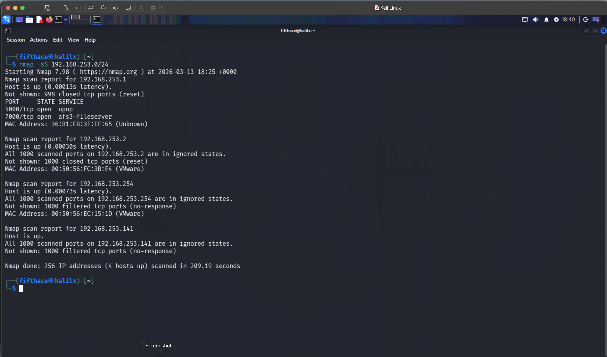

# Nmap Network Scan Lab

## Objective

The goal of this lab was to perform a basic network scan using Nmap to identify active hosts and open ports within the network.

## Tool Used

Nmap – Network discovery and security auditing tool.

## Command Used

nmap -sS 192.168.253.0/24

## Network Range

192.168.253.0/24

## Results

4 hosts were discovered during the scan.

### Host: 192.168.253.1
Status: Up

Open ports:
5000/tcp – UPnP
7000/tcp – AFS3 File Server

MAC Vendor: Unknown

### Host: 192.168.253.2
Status: Up

All scanned ports were closed.

MAC Vendor: VMware

### Host: 192.168.253.254
Status: Up

All scanned ports filtered.

MAC Vendor: VMware

### Host: 192.168.253.141
Status: Up

No open ports detected.

This host is the Kali Linux machine used for scanning.

## Analysis

The scan results indicate that the network belongs to a VMware NAT environment.  
Multiple hosts are part of VMware infrastructure services.

No external hosts or home network devices were detected because the virtual machine is currently connected to a NAT virtual network rather than a bridged network.

## Screenshot

See the screenshot in the screenshots folder.

