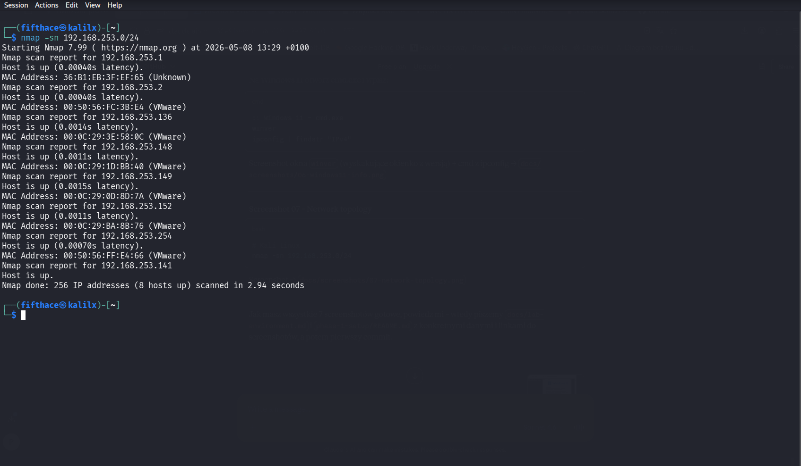
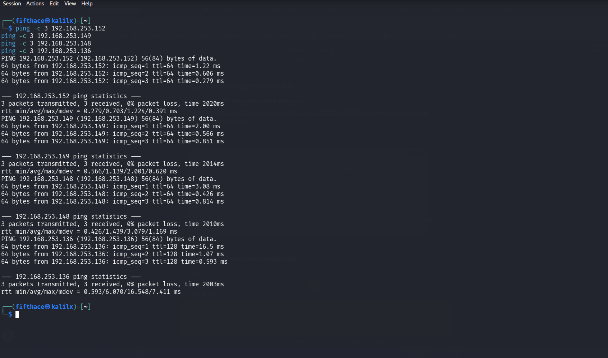

# Lab Environment

## Overview

This lab runs entirely inside **VMware Fusion** on macOS. All machines operate on an isolated host-only network with no internet access from the target machines. The attack machine (Kali Linux) is the only system with outbound access for package installation.

## Network

|     Network     |          Address          |
|-----------------|---------------------------|
| Subnet          | 192.168.253.0/24          |
| Type            | VMware Fusion – Host-Only |
| Internet access | Attack machine only       |

## Machines

|   Role   |       OS       |    IP Address   | Hostname |
|----------|----------------|-----------------|----------|
| Attack   | Kali Linux     | 192.168.253.141 | kalilx   |
| Target 1 | Ubuntu Server  | 192.168.253.152 | ubuntu   |
| Target 2 | Fedora Server  | 192.168.253.149 | localhost|
| Target 3 | Fedora Linux   | 192.168.253.148 | fedora   |
| Target 4 | Windows 11 Pro | 192.168.253.136 | 5AWin11  |

## System Details

### Kali Linux (Attack Machine)
- **Version:** Kali Linux Rolling 2026.1
- **User:** fifthace
- **Role:** Running all attack scripts, tools, and maintaining the GitHub repository
- **Tools installed:** Python 3, Hashcat, John the Ripper, Hydra, Nmap

### Ubuntu Server (Target 1)
- **IP:** 192.168.253.152
- **User:** fifthace
- **Role:** Primary target – SSH brute-force, web login, MySQL hash cracking
- **Services:** SSH (port 22), HTTP, MySQL

### Fedora Server (Target 2)
- **IP:** 192.168.253.149
- **User:** fifthace
- **Role:** Network services target – SSH and HTTP basic auth brute-force
- **Services:** SSH (port 22), HTTP (port 80)

### Fedora Linux (Target 3)
- **IP:** 192.168.253.148
- **User:** fifthace
- **Role:** Local hash extraction – /etc/shadow cracking
- **Services:** SSH (port 22)

### Windows 11 Pro (Target 4)
- **IP:** 192.168.253.136
- **Version:** 25H2 (OS Build 26200.8328)
- **User:** piotr
- **Role:** SAM database hash extraction (Phase 3)
- **Notes:** ICMP enabled manually via Windows Firewall rule

## Network Topology

## Connectivity Verification

All machines verified reachable from Kali Linux via ICMP ping before starting the lab.

