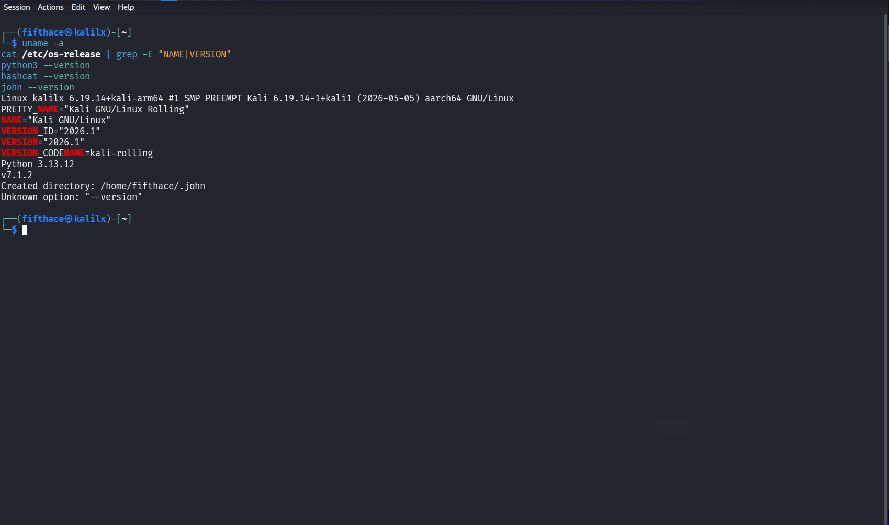
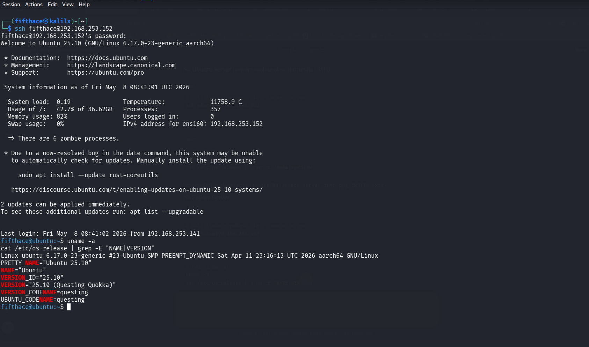
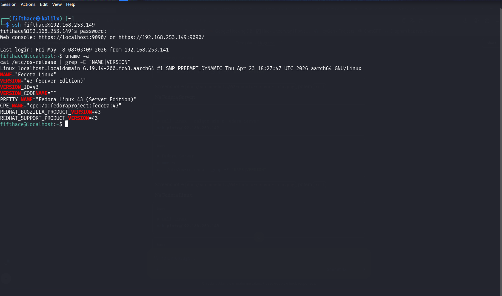
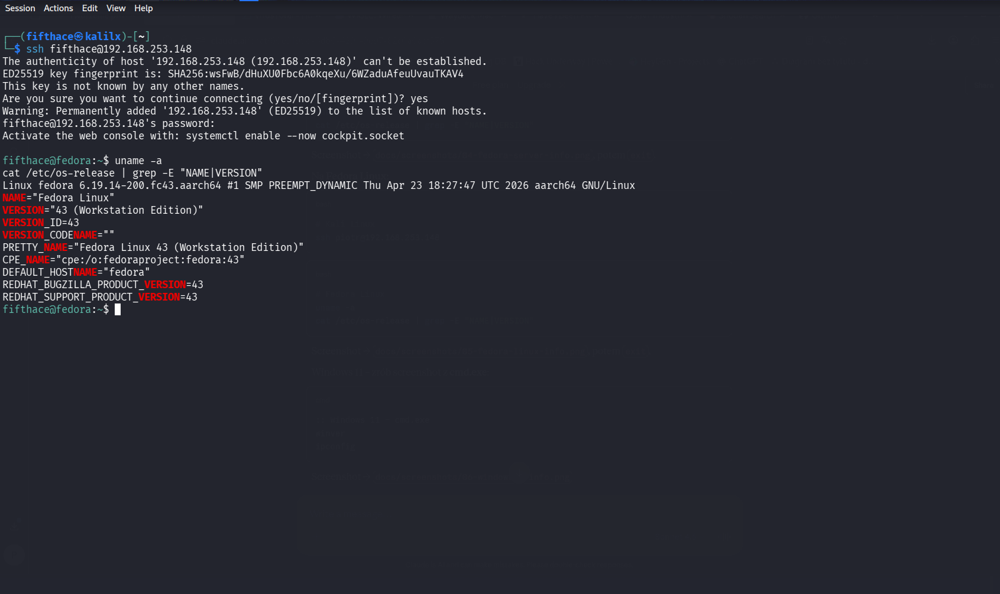
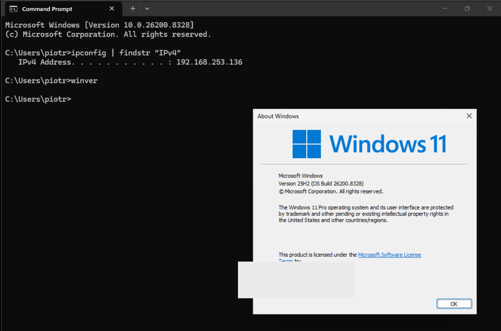

# Phase 1 – Environment Setup & Hash Basics

## Objectives

- Verify lab connectivity between all machines
- Understand common hash types used in password storage
- Generate hashes manually using Python
- Write a first basic hash-matching script in Python

## Lab Machines Used in This Phase

|   Machine  |        IP       |       Purpose       |
|------------|-----------------|---------------------|
| Kali Linux | 192.168.253.141 | Running all scripts |

---

## Step 1 – Connectivity Verification

Before any attack activity, all target machines were verified as reachable from the attack machine.

**On Kali Linux:**
```bash
ping -c 3 192.168.253.152   # Ubuntu Server
ping -c 3 192.168.253.149   # Fedora Server
ping -c 3 192.168.253.148   # Fedora Linux
ping -c 3 192.168.253.136   # Windows 11
```

All four machines responded successfully.

> **Note:** Windows 11 blocks ICMP by default. ICMP was enabled with:
> ```powershell
> # Windows 11 – PowerShell (Administrator)
> netsh advfirewall firewall add rule name="Allow ICMPv4" protocol=icmpv4:8,any dir=in action=allow
> ```


---

## Step 2 – Tool Versions

All tools verified on Kali Linux before starting:

```bash
# Kali Linux
uname -a
cat /etc/os-release | grep -E "^NAME|^VERSION"
python3 --version
hashcat --version
john --version
hydra --version
```



---

## Step 3 – Target Machine Information

### Ubuntu Server (192.168.253.152)

```bash
# Kali Linux
ssh fifthace@192.168.253.152
```

```bash
# Ubuntu Server
uname -a
cat /etc/os-release | grep -E "^NAME|^VERSION"
exit
```



### Fedora Server (192.168.253.149)

```bash
# Kali Linux
ssh fifthace@192.168.253.149
```

```bash
# Fedora Server
uname -a
cat /etc/os-release | grep -E "^NAME|^VERSION"
exit
```



### Fedora Linux (192.168.253.148)

```bash
# Kali Linux
ssh fifthace@192.168.253.148
```

```bash
# Fedora Linux
uname -a
cat /etc/os-release | grep -E "^NAME|^VERSION"
exit
```



### Windows 11 (192.168.253.136)

Verified via `winver` and `ipconfig` on the Windows 11 machine directly.

- **Version:** Windows 11 Pro, Version 25H2 (OS Build 26200.8328)
- **IP:** 192.168.253.136



---

## Step 4 – Understanding Hash Types

Passwords are never stored in plain text on modern systems. Instead, a **hash function** converts the password into a fixed-length string. The same input always produces the same hash, but the process is one-way – you cannot reverse a hash back to the original password.

### Common hash types

| Hash Type |                Example output              |          Used in           |
|-----------|--------------------------------------------|----------------------------|
| MD5       | `5f4dcc3b5aa765d61d8327deb882cf99`         | Legacy web apps, old Linux |
| SHA-1     | `5baa61e4c9b93f3f0682250b6cf8331b7ee68fd8` | Git, old systems           |
| SHA-256   | `5e884898da28...`                          | Modern applications        |
| bcrypt    | `$2b$12$...`                               | Modern Linux, web apps     |
| NTLM      | `8846f7eaee8fb117...`                      | Windows SAM database       |

### Generating hashes with Python

```bash
# Kali Linux
python3
```

```python
import hashlib

password = "password"

md5    = hashlib.md5(password.encode()).hexdigest()
sha1   = hashlib.sha1(password.encode()).hexdigest()
sha256 = hashlib.sha256(password.encode()).hexdigest()

print(f"MD5:    {md5}")
print(f"SHA-1:  {sha1}")
print(f"SHA-256:{sha256}")
```

**Expected output:**
