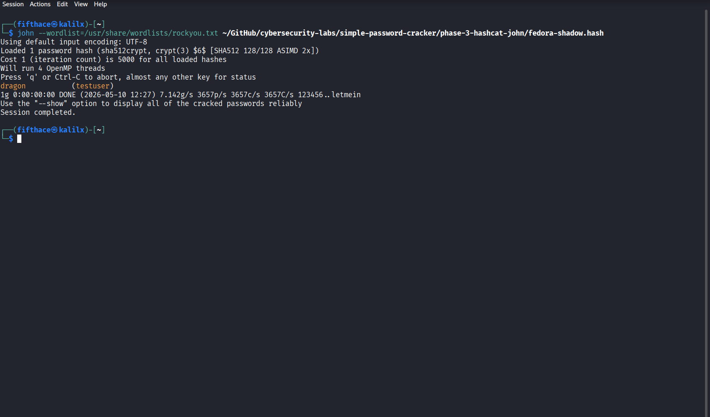
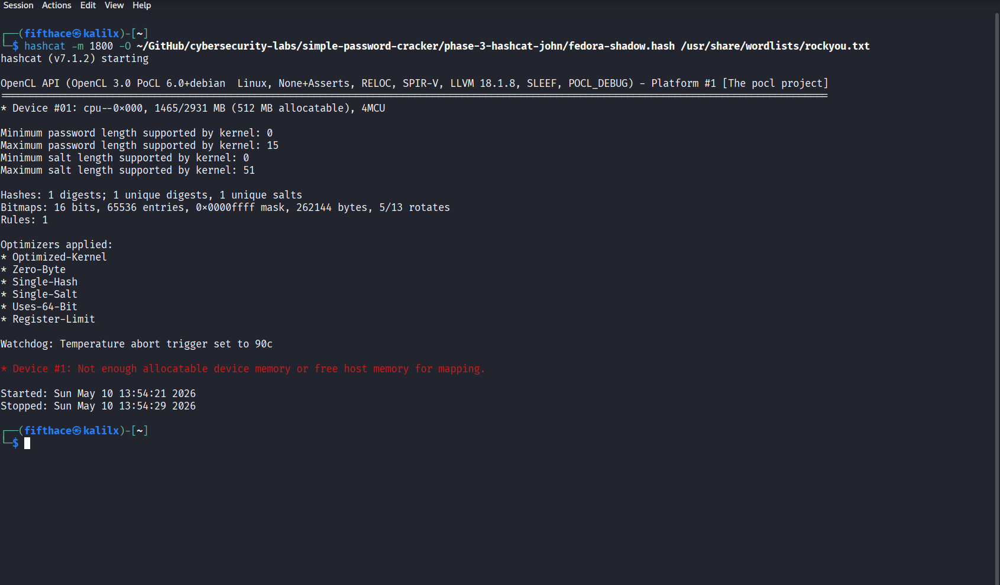

# Phase 3 – Hashcat & John the Ripper

## Objectives

- Extract a password hash from /etc/shadow on Fedora Linux
- Understand hash algorithm types ($y$ yescrypt vs $6$ SHA-512)
- Crack a SHA-512 hash using John the Ripper
- Attempt the same attack with Hashcat and document VM resource limitations

## Lab Machines Used in This Phase

|   Machine    |       IP        |         Purpose          |
|--------------|-----------------|--------------------------|
| Kali Linux   | 192.168.253.141 | Running John and Hashcat |
| Fedora Linux | 192.168.253.148 | Hash extraction target   |

---

## Background – /etc/shadow

On Linux systems, password hashes are stored in `/etc/shadow`. This file is readable only by root. Each entry looks like:

```
username:$algorithm$salt$hash:last_changed:min:max:warn:inactive:expire:
```

Common algorithm identifiers:

|Prefix |Algorithm |             Security                |
|-------|----------|-------------------------------------|
| `$1$` | MD5      | Weak – deprecated                   |
| `$6$` | SHA-512  | Strong – widely used                |
| `$y$` | yescrypt | Very strong – modern Fedora default |

---

## Step 1 – Target Setup on Fedora Linux

A dedicated test user was created on Fedora Linux with an intentionally weak password.

```bash
# Kali Linux
ssh fifthace@192.168.253.148
```

```bash
# Fedora Linux
sudo adduser testuser
sudo passwd testuser
# Password set to: dragon
```

---

## Step 2 – Changing Hash Algorithm from yescrypt to SHA-512

Fedora 40 uses **yescrypt** (`$y$`) by default. Neither John the Ripper nor Hashcat on Kali Linux supported this format at the time of testing. The algorithm was changed to SHA-512 to allow cracking.

**Why yescrypt is harder to crack:**
- Designed to be memory-hard (requires large amounts of RAM)
- Much slower to compute than SHA-512
- Resistant to GPU-based attacks

The change was made by editing the PAM configuration:

```bash
# Fedora Linux
sudo authselect opt-out
sudo sed -i 's/pam_unix.so yescrypt/pam_unix.so sha512/' /etc/pam.d/system-auth
sudo passwd testuser
# Password reset to: dragon – now hashed with SHA-512
```

Verified the new hash format:

```bash
# Fedora Linux
sudo cat /etc/shadow | grep testuser
```

Output:

```
testuser:$6$iivHBJFevlikcd2T$i.Rn1rBhA5vDUn2339rq1l1Y/xlI1IsYVSheHkP5AHlYrCIz7QglliI8vMeU1M8uDECYzl0E9IfqxbW36Tc7a0:20583:0:99999:7:::
```

The `$6$` prefix confirms SHA-512.

---

## Step 3 – Copying Hash to Kali Linux

```bash
# Fedora Linux
exit
```

```bash
# Kali Linux
echo 'testuser:$6$iivHBJFevlikcd2T$i.Rn1rBhA5vDUn2339rq1l1Y/xlI1IsYVSheHkP5AHlYrCIz7QglliI8vMeU1M8uDECYzl0E9IfqxbW36Tc7a0:20583:0:99999:7:::' > phase-3-hashcat-john/fedora-shadow.hash
```

---

## Step 4 – Cracking with John the Ripper

```bash
# Kali Linux
john --wordlist=/usr/share/wordlists/rockyou.txt phase-3-hashcat-john/fedora-shadow.hash
```

Output:

```
Loaded 1 password hash (sha512crypt, crypt(3) $6$ [SHA512 128/128 ASIMD 2x])
Cost 1 (iteration count) is 5000 for all loaded hashes
Will run 4 OpenMP threads

dragon           (testuser)

1g 0:00:00:04 DONE (2026-05-10 12:16) 0.2439g/s 3996p/s
Session completed.
```

Result: Password `dragon` cracked in 4 seconds.



---

## Step 5 – Attempting Hashcat (VM Limitation)

```bash
# Kali Linux
hashcat -m 1800 -O phase-3-hashcat-john/fedora-shadow.hash /usr/share/wordlists/rockyou.txt
```

Hashcat failed with a memory allocation error:

```
* Device #1: Not enough allocatable device memory or free host memory for mapping.
```



**Why this happened:**

|       Factor        |                                  Detail                                 |
|---------------------|-------------------------------------------------------------------------|
| Available RAM       | 1465 MB (VMware Fusion VM)                                              |
| Hashcat requirement | SHA-512 mode requires significantly more allocatable memory             |
| No GPU              | VM uses CPU-only OpenCL (PoCL), much slower and more memory constrained |

In a real-world scenario, Hashcat running on a dedicated machine with a modern GPU (e.g. NVIDIA RTX 4090) would crack SHA-512 hashes at billions of attempts per second. The VM limitation here is a hardware constraint, not a tool limitation.

---

## Summary

|      Tool       | Result  |   Time    |                Notes                |
|-----------------|---------|-----------|-------------------------------------|
| John the Ripper | Cracked | 4 seconds | SHA-512, rockyou.txt, 4 CPU threads |
| Hashcat         | Failed  |     —     | Insufficient RAM in VM environment  |

## Key Takeaways

|   What we learned   |                               Detail                                  |
|---------------------|-----------------------------------------------------------------------|
| yescrypt vs SHA-512 | Modern algorithms are memory-hard by design, resisting cracking tools |
| John the Ripper     | Effective for CPU-based hash cracking, auto-detects hash format       |
| Hashcat             | Requires more resources – designed for GPU acceleration               |
| VM limitations      | Real-world cracking rigs use dedicated hardware with multiple GPUs    |

## Next Phase

[Phase 4 – Network Services: SSH & HTTP Brute-Force](../phase-4-network-services/)
